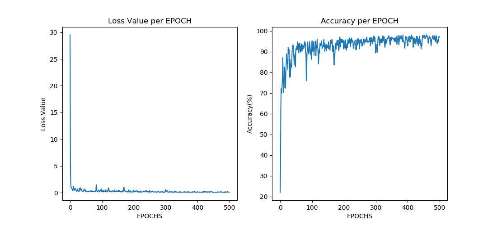
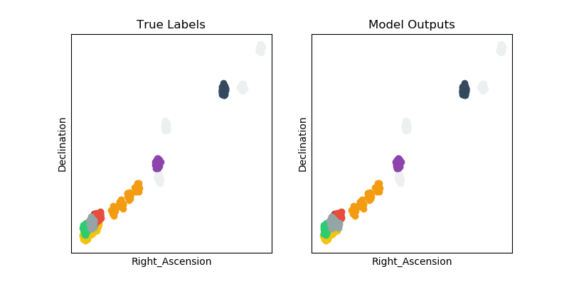
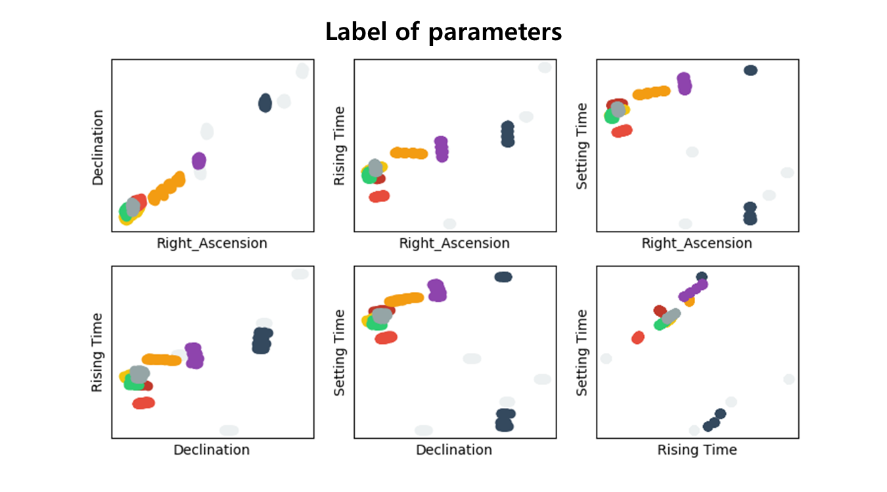
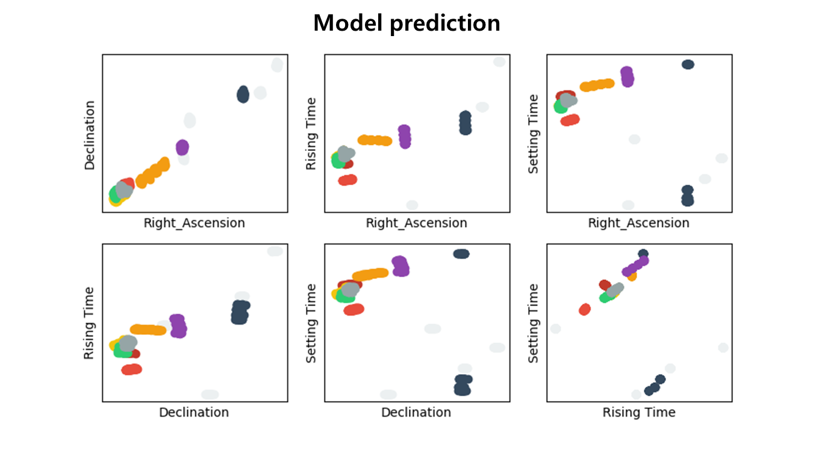

# ◉ Planets of January : Deep-Learning Classifier

천체에 대한 호기심이 솟구쳐서 진행하게 되었습니다 \(￣︶￣\*\))

### ✔ 딥러닝(Deep-Learning)이란?

딥러닝은 간단하게 말해서 심층신경망(Deep Neural Network)을 기반으로 데이터를 학습하여 특정 임무를 수행하는 능력을 스스로 갖춰나가는 컴퓨터 알고리즘이다.  
다중 분류기, 이미지 처리, 시계열 데이터 분석 등 다양한 분야에 이용된다.

### ✔ 프로젝트 개요

본 프로젝트는 태양과 달을 포함한 태양계의 9개 천체에 대한 1월 관측자료를 기반으로 데이터셋을 생성한 다음 모델을 정의하고 학습시켜 행성들을 구분하는 분류기를 만드는 것을 목표로 한다.

Python의 tensorflow모듈을 이용하여 진행하였다.

### ✔ 데이터 수집

한국천문연구원에서는 매년 항성, 행성을 비롯한 다양한 천체들의 관측자료를 정리한 천문역서를 발행하고 있으며 2019년 11월에 발행된 <2020년 역서>에서 다음 천체들의 1월 관측자료를 발췌하였다.  
(김진욱 선생님 감사해요 (┬┬﹏┬┬) )

- 관측날짜(월/일): 1/1, 1/6, 1/11, 1/16, 1/21, 1/26, 1/31  
  (해왕성과 천왕성의 경우 1/6, 1/16, 1/26에 해당하는 자료가 없음)

- 관측천체

  - 지구를 제외한 태양계 행성
  - 태양
  - 달

- 발췌한 관측자료
  - 적경
  - 적위
  - 일출시각
  - 일몰시각

본 관측자료를 csv파일로 정리한 다음 tensorflow모듈을 이용하여 npz형태의 dataset으로 저장하였다.

관측자료(값): January-dataset.npz

### ✔ 모델 생성 및 학습

딥러닝의 생소한 용어로 어려울 수 있으니 관측자료는 좌표평면 위의 점이고 딥러닝은 그 점의 위치와 종류를 찾아가는 방법으로 비유하여 설명하도록 하겠다.

데이터 가공 및 학습은 다음과 같은 과정을 통해 이루어진다.

- 데이터 가공
  관측자료를 읽어들인 뒤 자료 주변으로 랜덤하게 값을 증폭시킨다.  
  (점의 크기는 작으니 잘 찾을 수 있도록 점의 크기를 키운다)

- 모델 정의
  input 데이터를 바탕으로 학습을 진행하는 모델을 정의한다.  
  (데어터를 바탕으로 이 점은 어떤 행성을 나타내는지 맞출 지능을 설계한다)

- 학습 진행
  점의 종류를 예측하고 오답을 통해 정답률을 개선시키면서 학습을 진행한다.  
  최대 정확도 98%

  

  위 그래프를 통해 알 수 있듯, 손실함수값(오답률)은 점점 감소하고, 정확도(정답률)은 점점 증가함을 알 수 있다.

- 학습 결과 저장
  학습 결과 즉, 점의 종류를 알아맞추는 방법을 저장한다.
  학습결과: January_parameter.npz

### ✔ 모델 성능 테스트

학습한 모델에게 임의의 관측결과가 주어졌을 때 어떤 행성의 관측결과인지 맞추게 하여 그 성능을 테스트한다.

왼쪽 그림은 관측자료 중 적경, 적위만을 변수로 하여 나타낸 결과이고 오른쪽 그림은 모델이 예상한 결과이다. 같은 색깔은 같은 행성을 나타낸다.

두 그림을 비교했을 때 상당히 유사함을 알 수 있다. 왼쪽 아래 점들이 모여있는 부분에서 약간의 차이를 관찰할 수 있다.

다음 그림은 적경, 적위, 일몰시각, 일출시각 중 2가지씩 뽑아서 나타낸 결과이다.

아래 그림은 모델의 예측 결과이다.

그림을 통해 알 수 있듯 정답과 예측결과의 차이가 매우 적다.  
숨은그림찾기를 해도 손색이 없다.

### ✔ 탐구의 확장 가능성

- 확장된 천체 분류기  
  특정 천체의 1월 관측자료만 사용하였으므로 상대적으로 간단한 분류기라고 할 수 있다. 1년 전체의 관측자료를 충분히 이용하여 혜성과 같은 다른 천체까지 분류할 수 있을 것이다.
